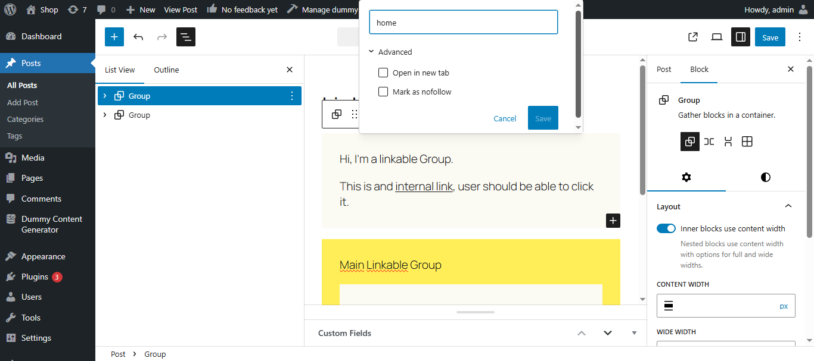
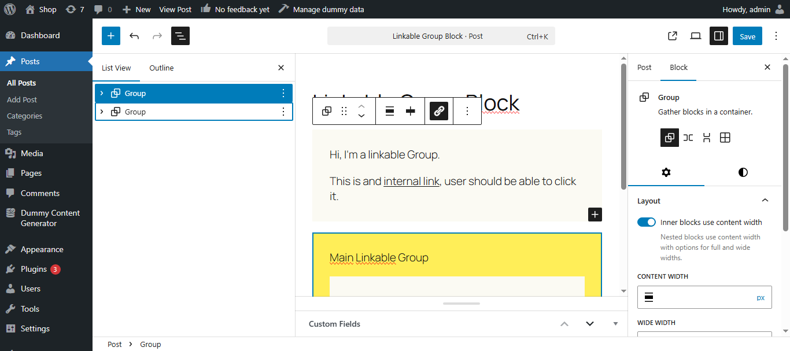
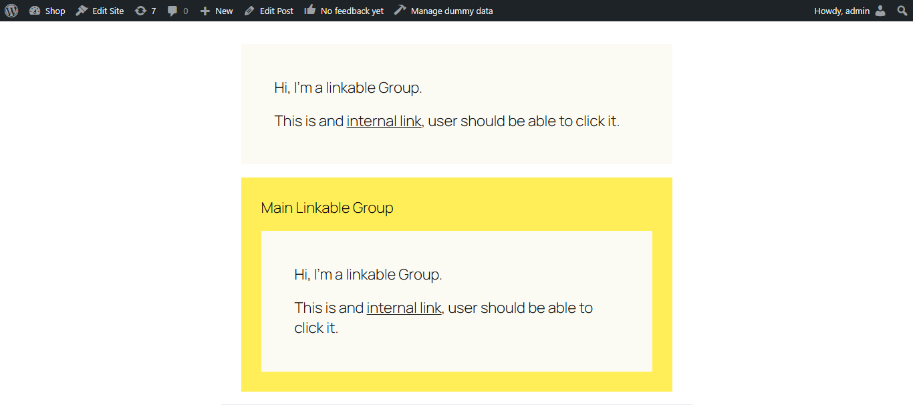

# Linkable Group Block

A WordPress block editor enhancement that allows you to add a link to any `core/group` block using a toolbar button.

---

## Features

- Add a clickable link to any Group block.
- Toggle "Open in new tab".
- Mark the link as `nofollow`.
- Easily remove, copy, or edit the link from a toolbar popover.
- Uses native WordPress `LinkControl` for a consistent UX.

---

## How It Works

- A toolbar button appears when selecting a Group block.
- Clicking the button opens a link popover using `LinkControl`.
- Adds a `.stretched-link` overlay to make the entire group clickable.
- Applies a wrapper link at the front-end using `linkUrl`, `linkTarget`, `rel`, and `title` attributes.

---

## Known Limitation: Nested Linkable Groups

If you nest a `Group` block with a link **inside another linked Group block**, the inner block's link may not be clickable due to overlapping stretched-link layers.

**Why this happens**:

- The outer `.stretched-link::after` pseudo-element overlaps the inner one.
- CSS stacking and `pointer-events` compete.

### Temporary Workarounds:

- Avoid nesting linkable groups if possible.
- Use custom CSS to manage `z-index` or disable the outer link when a nested group is present.

---
